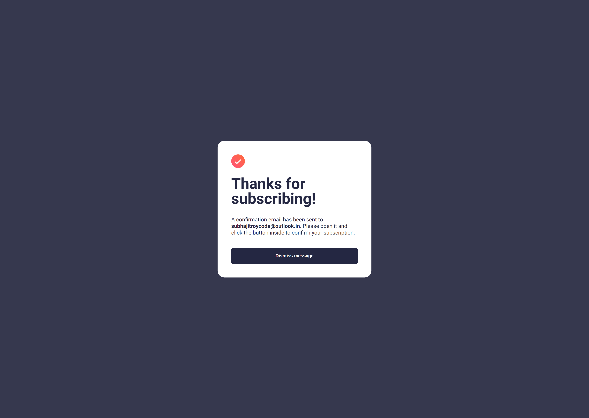

# Frontend Mentor - Newsletter sign-up form with success message solution

This is a solution to the [Newsletter sign-up form with success message challenge on Frontend Mentor](https://www.frontendmentor.io/challenges/newsletter-signup-form-with-success-message-3FC1AZbNrv). Frontend Mentor challenges help you improve your coding skills by building realistic projects. 

## Table of contents

- [Frontend Mentor - Newsletter sign-up form with success message solution](#frontend-mentor---newsletter-sign-up-form-with-success-message-solution)
  - [Table of contents](#table-of-contents)
  - [Overview](#overview)
    - [The challenge](#the-challenge)
    - [Screenshot](#screenshot)
    - [Links](#links)
  - [My process](#my-process)
    - [Built with](#built-with)
    - [What I learned](#what-i-learned)
    - [Useful resources](#useful-resources)
  - [Author](#author)

## Overview

### The challenge

Users should be able to:

- Add their email and submit the form
- See a success message with their email after successfully submitting the form
- See form validation messages if:
  - The field is left empty
  - The email address is not formatted correctly
- View the optimal layout for the interface depending on their device's screen size
- See hover and focus states for all interactive elements on the page

### Screenshot




### Links

- Live Site URL: [Click here](https://your-live-site-url.com)

## My process

### Built with

- Semantic HTML5 markup
- CSS custom properties
- Flexbox
- [React](https://reactjs.org/) - JS library

### What I learned

I get to learn about picture tag and how to use it, use new CSS media query syntax and useref hook to get the input value.

```html
<picture>
    <source
        media="(max-width: 650px)"
        srcSet="/illustration-sign-up-mobile.svg"
    />
    
</picture>
```
```css
@media (width <= 650px) {
  body {
    display: block;
  }
}
```

### Useful resources

- [Picture tag](https://www.w3schools.com/tags/tag_picture.asp) - This helped me for picture tag.
- [Media Query Syntax](https://css-tricks.com/the-new-css-media-query-range-syntax/) - This is an amazing article which helped me finally understand the new media query syntax. I'd recommend it to anyone still learning this concept.

## Author

- Frontend Mentor - [@subhajitroycode](https://www.frontendmentor.io/profile/subhajitroycode)
- Twitter - [@subhajitroycode](https://www.twitter.com/subhajitroycode)
- LinkedIn - [@subhajitroycode](https://www.linkedin.com/in/subhajitroycode)